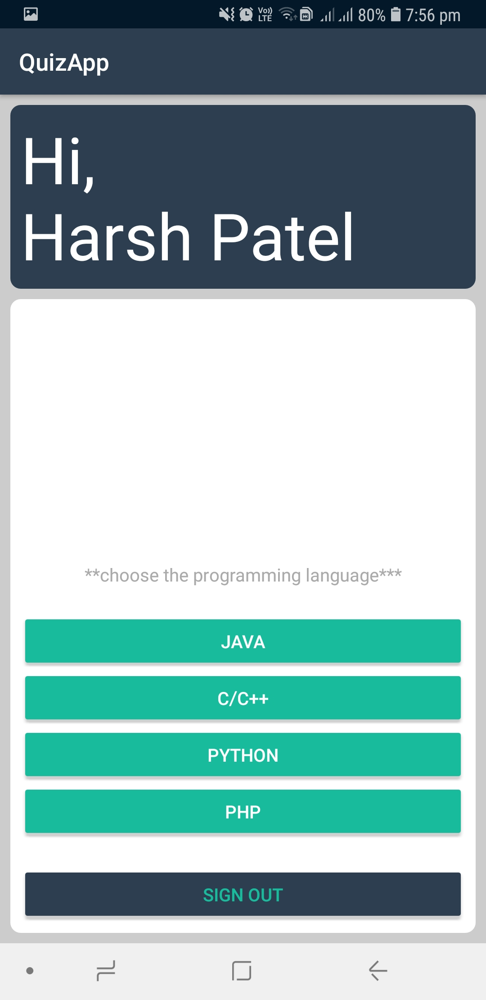
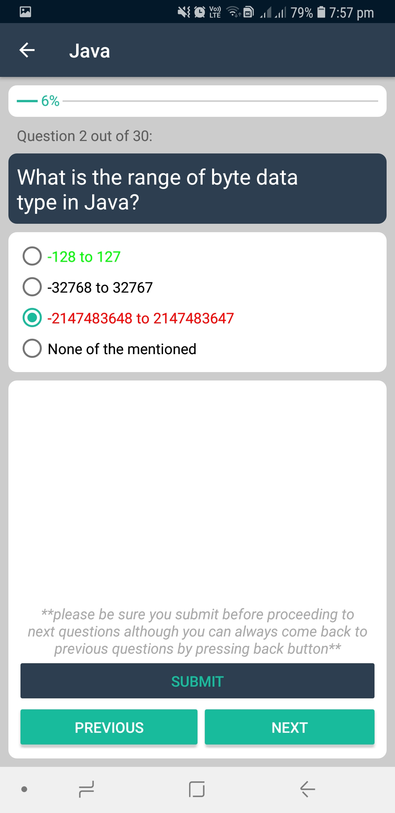

QuizApp
===================================

Simple Android Quiz Application

Introduction
------------

This application is just made throughout my attempt to learn things and tweak things to suit my taste.

Pre-requisites
--------------

- Android SDK 27
- Android Build Tools v28.0.0
- Android Play Services
- [NumberProgressBar](https://github.com/daimajia/NumberProgressBar)

Screenshots
-------------

Login Activity|Main Activity|Quiz Activity-II|Quiz Activity-II|Result Activity
:------------:|:-----------:|:--------------:|:--------------:|:-------------:
  |    |    |    | 

Getting Started
---------------

This sample uses the Gradle build system. To build this project, use the
"gradlew build" command or use "Import Project" in Android Studio.

Support
-------

If you've found an error in this sample, please file an [issue](https://github.com/harsh8398/QuizApp/issues/new).

License
-------

This project is licensed under the MIT License - see the [LICENSE](LICENSE) file for details
